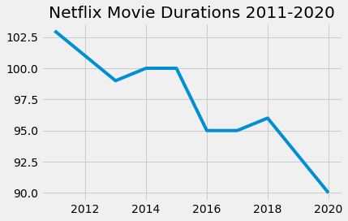

# 🎥 Netflix_Analytics
Simple data science project that gets duration insights from netflix movies

## 🤔 How to use this project

To get started just open the notebook.ipynb using jupyter notebook or any other equivalent

NOTE: You need to also download the datasets folder in order for project to work 

## 💁 What You're Getting
```bash
├── notebook.ipynb
├── datasets folder
```

## 📸 Visualizations from the Project


<br/>


